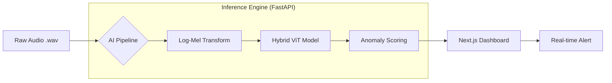

---

# Acoustic Anomaly Detection for Industry 4.0
### Unsupervised Deep Learning Suite for Industrial Asset Health Monitoring

[](https://www.python.org/downloads/)
[](https://fastapi.tiangolo.com/)
[](https://nextjs.org/)
[](https://pytorch.org/)

This repository contains an end-to-end industrial AI framework designed to detect mechanical anomalies in industrial assets (Fans, Pumps, Valves, Sliders) using acoustic emissions. By utilizing the **MIMII Dataset**, the system employs unsupervised deep learning to identify "unseen" failure modes without requiring labeled malfunction data.

---

## 🏗️ System Architecture

The project bridges the gap between high-performance deep learning research and production-grade deployment.



## 🚀 Key Features

- **Multi-Model Architecture:** Supports CNN-VAE, Vision Transformers (ViT), and a custom Hybrid ConvStem-Transformer.
- **Big Data Optimization:** An "on-the-fly" preprocessing pipeline capable of handling 100.2 GB of audio data without intermediate disk storage.
- **Noise Robustness:** Validated performance in high-interference factory environments (up to -6dB SNR).
- **Full-Stack Deployment:** A modern, glassmorphic diagnostic dashboard for real-time acoustic fingerprinting.
- **Inference-Training Parity:** Engineered solution for spectral padding artifacts ensuring high accuracy in production.

## 📊 Model Performance

| Asset Category | Best Architecture  | p-AUC (0dB) | Key Strength                      |
| :------------- | :----------------- | :---------- | :-------------------------------- |
| **Slider**     | CNN-VAE            | **0.99**    | Spatial transient detection       |
| **Pump**       | Vision Transformer | **0.89**    | Global rhythmic modeling          |
| **Valve**      | Hybrid ConvStem    | **0.80**    | Transient-within-cycle extraction |
| **Fan**        | ViT                | **0.78**    | Harmonic signature recognition    |

---

## 🛠️ Installation & Setup

### 1. Backend (FastAPI & PyTorch)

```bash
# Clone the repository
git clone https://github.com/bses7/industry-anomaly-detection.git
cd industry-anomaly-detection

# Create a virtual environment
python -m venv venv
source venv/bin/activate  # Windows: .\venv\Scripts\activate

# Install dependencies
pip install -r requirements.txt

# Start the server
python server.py
```

### 2. Frontend (Next.js)

```bash
cd frontend
npm install
npm run dev
```

The dashboard will be available at `http://localhost:3000`.

---

## 🧠 Research Insights

### The Hybrid Breakthrough

While standard Vision Transformers (ViT) excel at capturing the periodic rhythms of pumps, they often "smooth over" the sharp clicks of failing valves. Our **Hybrid ConvStem** architecture introduces convolutional layers before the Transformer blocks, acting as a learned tokenizer that preserves local textures while maintaining global context.

### Numerical Stability

Training on high-resolution spectrograms ($128 \times 320$) initially led to gradient explosions ($10^{35}$). This was resolved by transitioning from **Sum-Loss** to **Mean-Loss scaling** and implementing **Gradient Clipping**, ensuring a stable latent space manifold.

---

## 📂 Project Structure

```text
├── experiments/             # Pre-trained .pth model weights
├── src/
│   ├── data/                # Scalable JIT Preprocessing
│   ├── models/              # CNN-VAE, ViT, and Hybrid architectures
│   ├── evaluation/          # DCASE standard p-AUC metrics
│   └── utils/               # Config loaders and visualization engines
├── server.py                # FastAPI Production Server
├── main.py                  # CLI Inference Tool
├── config.yaml              # Global Hyperparameters
└── requirements.txt         # Environment specifications
```

## 📜 Dataset

This project utilizes the **MIMII (Malfunctioning Industrial Machines Investigation and Inspection)** dataset.

- **Source:** [Zenodo MIMII Dataset](https://zenodo.org/record/3384388)
- **Citation:** Purohit, H. et al., "MIMII Dataset: Sound Dataset for Malfunctioning Industrial Machines," arXiv:1909.09347.

## 🤝 Contributing

Contributions are welcome! If you're interested in implementing **Self-Supervised Learning (SSL)** or **Edge Quantization**, please open an issue or submit a pull request.

---

**Developed by [Bishesh Giri](https://github.com/bses7)**
